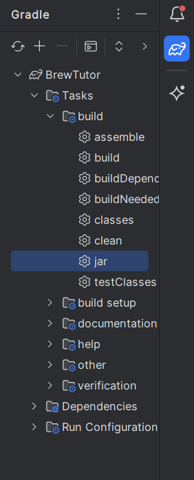

# BrewTutor: Minecraft Brewing AI Tutor Plugin

## Table of Contents
  - [Overview](#overview)
  - [Setup & Installation](#setup--installation)
    - [Requirements](#requirements)
    - [Setting Up a Spigot Server](#setting-up-a-spigot-server)
    - [Compiling The Plugin](#compiling-the-plugin)
    - [Installing the Plugin](#installing-the-plugin)
  - [BrewTutor Outline](#brewtutor-outline)
    - [What Do I Need To Play?](#what-do-i-need-to-play)
    - [Commands](#commands)
    - [Supported Potions](#supported-potions)
  - [Dev Notes](#dev-notes)

## Overview
This is an AI tutor prototype for teaching players how to use the brewing system in Minecraft. It is a plugin that utilizes the [Bukkit](https://dev.bukkit.org/) Minecraft development libraries and was tested and ran on a [Spigot](https://www.spigotmc.org/) server.

## Setup & Installation

#### Requirements:
> - Install [IntelliJ](https://www.jetbrains.com/idea/)
> - Add the [Minecraft Development Plugin](https://plugins.jetbrains.com/plugin/8327-minecraft-development/versions#tabs) to your installation of IntelliJ
> - Set your [project SDK](https://www.jetbrains.com/help/idea/sdk.html#change-project-sdk) to OpenJDK 17 
> - A Spigot server (see below)

### Setting Up a Spigot Server
Spigot has a nice helpful walkthrough on the installation process of their servers using BuildTools. We followed the installation process (linked below) for Windows, but they offer instructions for Linux and Mac OS as well. 

> **Spigot Server Installation Docs:** https://www.spigotmc.org/wiki/spigot-installation/ 

Follow the instructions in the **Prerequisites** section to set up BuildTools and compile the server jar file. Then follow the installation steps for your OS in the **Installation** section. 

The BuildTools wiki is linked in the **Prerequisites** of the Spigot Server Installation Docs but we've also linked it here for your conviencence:

> **BuildTools Wiki:** https://www.spigotmc.org/wiki/buildtools/#prerequisites 

Once your server is up and running, follow the instructions in the [Compiling The Plugin](#Compiling-The-Plugin) section to begin setting up the plugin. 

To stop your server before installing the plugin, run <code>stop</code> in the command line window that popped up when you ran the <code>start.bat</code> script. 

### Compiling The Plugin

>**NOTE:** Please ensure you've completed the setup tasks in the [Requirements](#Requirements) section.

After [cloning](https://docs.github.com/en/repositories/creating-and-managing-repositories/cloning-a-repository) this repository to your local machine, open the <code>BrewTutor</code> folder in IntelliJ.

On the right hand side, set your build task to **jar**:

Then build the project. This should build the jar file for the plugin and place it in:

> [your-directory]/[project-folder]/BrewTutor/build/libs/

The plugin jar file will be called: 

<code>BrewTutor-1.0.jar</code>

Compiling complete! Make sure to copy this jar file for future installation into your server.

### Installing the Plugin

> NOTE: Stop your sever BEFORE you install the plugin.

Now that you've [set up your server](#setting-up-a-spigot-server) and [compiled the plugin jar](#compiling-the-plugin), all that's left to do is put the plugin on your server.

Make sure you've copied your compiled plugin jar file and then navigate to the directory of your Spigot server. You should see a folder filled with files and other folders like so: 

Click into the **plugins** folder. Paste the compiled jar file into this folder. 

And now you're all set! Start up your server again by double clicking the <code>start.bat</code> script and you're now all ready to play with the BrewTutor plugin!

## BrewTutor Outline

### What Do I Need To Play?:
Nothing! This tutor plugin provides you with:
- A brewing stand
- A cauldron
- Necessary brewing materials

This tutor does not require you to supply your own brewing environment in game, however, we assume players utilizing this plugin have a basic knowledge of how to play Minecraft and at least a small familiarity with Minecraft materials and biomes.

### Commands
> <code>/brewtutor:</code> toggles the BrewTutor on/off 
>
> <code>/hint:</code> when BrewTutor is enabled, you can use this command to recieve a hint about the next step. 

### Supported Potions
This tutor currently supports the learning of 6 different potions:
- Awkward Potion
- Regen Potion
- Potion of Leaping
- Potion of Healing
- Potion of Slowness
- Potion of Harming

We plan on expanding this to eventually support all possible potions.

## Dev Notes
Please note that this is a work-in-progress plugin and there are quite a few features still in development. Player permissions, anti-cheat measurements and other player behavior considerations have not been added yet. 

> NOTE: The tutor will not remember your progress if you disconnect from the server. However, it will remember your progress while in game. 
